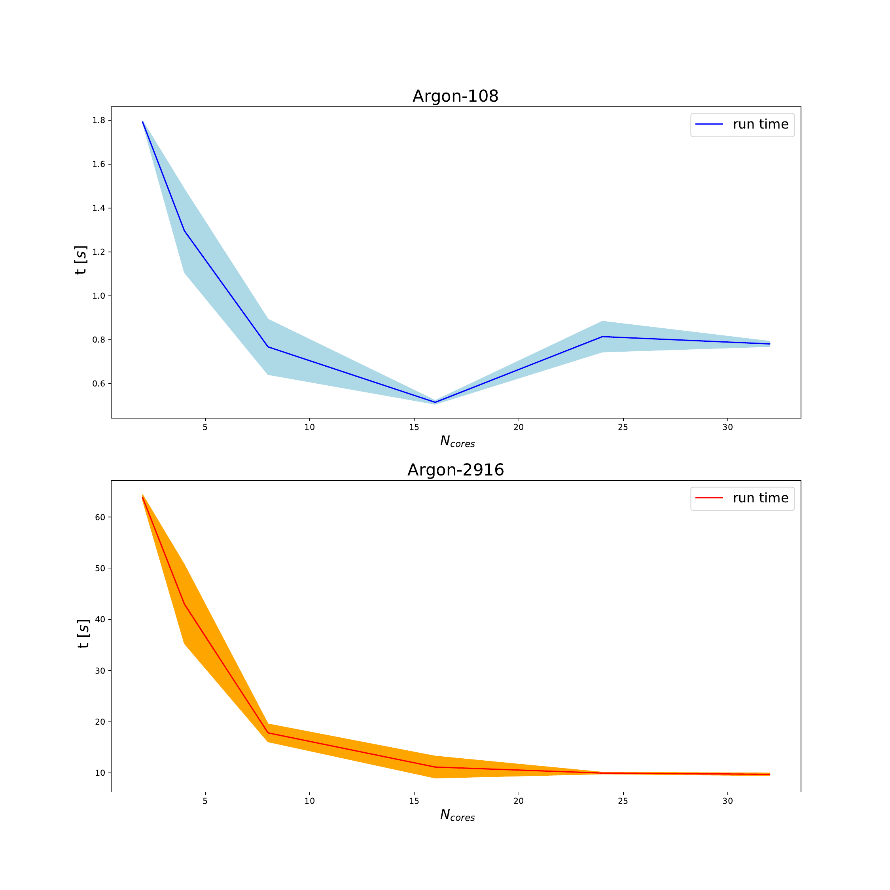
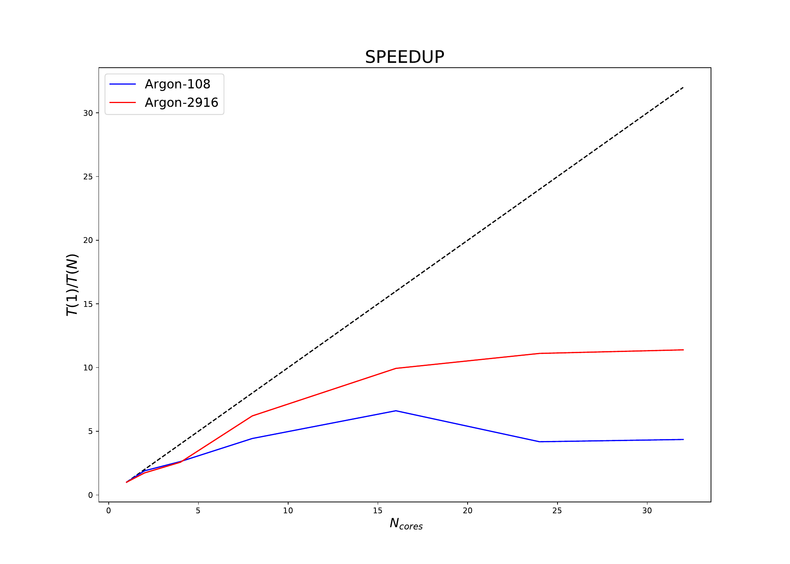

# Report of the LJMD Project
In this report we describe the steps followed for benchmarking the LJMD code, and the results obtained.

The benchmark process has been divided in 3 tasks:
 - refactoring/single-core optimization (assigned to S. Di Gioia)
 - MPI parallelization (assigned to A. Trujillo )
 - OMP parallelization (assigned to D. Banerjee)

## Compilation support for the LJMD code

A cmake version higher than 3.15 is required to run the code.

## Single-core optimization

This part focuses on the optimization of the serial code. 

We have advanced step by step:

Starting from the baseline code provided by A. Kohlmeier, we first improve the performances by exploiting the compiler optimization flags.

Then, we have considered different optimizations such as:
  - substituting costly mathematical operations with faster ones (for instance reducing the number of calls to sqrt and division operations as possible)
  - improving the data structure (to improve the memory access and avoid memory aliasing)
  - loop unrolling (in azzero function)
  - avoid repetitive operations, with the introduction of prefactors (in ekin, verlet and force function)
  

Then, we have applied our physical knowledge, and we optimize further the force calculation by means of the exploitations of the Newton's third law.

Clearly, we have implemented these improvements having in mind that these shall be mergeable with MPI and OpenMP. 

## MPI benchmark

A benchmark for MPI has been performed measuring computation times for [1, 32] cores for both argon_108.inp and argon_2916.inp. The benchmark took place on 2 computational nodes of the regular partiton 1 on the Ulysses cluster [at SISSA].
We performed 30 runs per each MPI configuration and select 2,4,8,16 cores on single node, and 24 and 32 corse divided by 2 nodes.

The results are presented below, both in graphical and tabular form. 

In the first plot we show the average time scaling of our code, with respect to the number of MPI tasks, where each MPI task is assigned to one distinct physical core.

We can observe that the code shows a better scaling for the simulation with a larger number of atoms,so with bigger size, and fewer steps  (Argon-2916).
This is even more evident in the plot with the average estimated SPEEDUP (S= T(1) /T(N) , where T(1): serial run time, or run time measured with 1 MPI task, and T(N): run time measured with N MPI tasks).

#Hybrid benchmark (with OMP)

